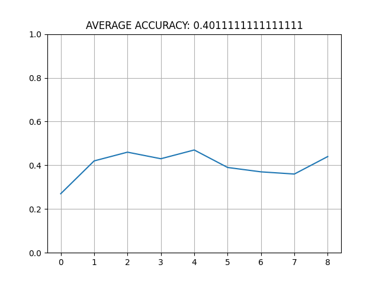

"# PathFinding" 
# Before Running simple_RL_run.py:
* Run _Astar.py: Using AStar algorithm to find the best way to get to the target and avoid obstacles
* Run _Testing.py: Simulate how the Jetbot reacts according to the AStar solutions. 

# Simple_RL: 
* simple_RL_run.py: Train the DQN in the simple_RL_env 
* Show the result at every 100 episodes 
* Save the neural network so that it can be reloaded without training
* Trainning results in 10000: 

# RL model test 
* Run the RLmodel_test.py 
* Test the RL model in 1000 episodes. 
* Show the average result along with the results at every 100 episodes 

# Improvement in this RL environment:
* `States:` expand 3 into 5 -> take the relative position to the target into account 
* `reward function:` The closer to the target, the greater reward each step will get. 
* note: I tried to use AStar to teach it but the results seems not to be so good. 

# RL_Weibo Folder
* Run run_RL.py 
* A RL reinforcement training with Polytope
* Contributed by Weibo Huang 
* Reference: MorvanZhou
