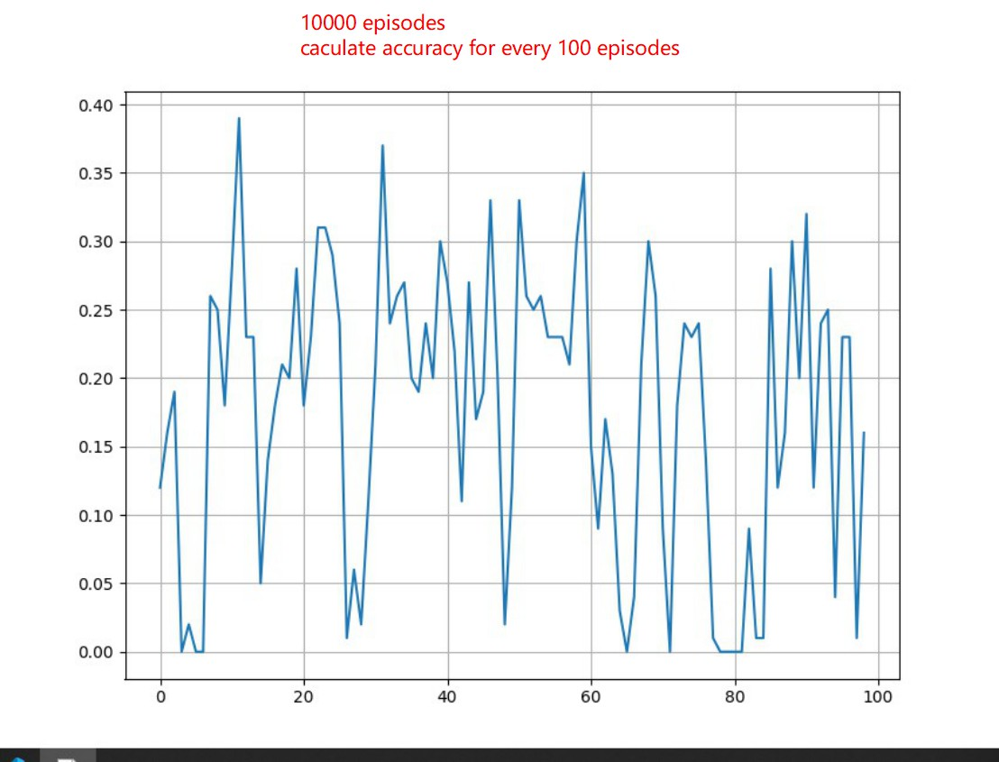

"# PathFinding" 
# Before Running simple_RL_run.py:
* Run _Astar.py: Using AStar algorithm to find the best way to get to the target and avoid obstacles
* Run _Testing.py: Simulate how the Jetbot reacts according to the AStar solutions. 

# Simple_RL 
* Run simple_RL_run.py: Build A simple RL training environment
* Trainning results: 

## Improvement
* `States:` expand 3 into 5 -> take the relative position to the target into account 
* `reward function:` The closer to the target, the greater reward each step will get. 
* note: I tried to use AStar to teach it but the results seems not to be so good. 

# RL_Weibo Folder
* Run run_RL.py 
* A RL reinforcement training with Polytope
* Contributed by Weibo Huang 
* Reference: MorvanZhou
